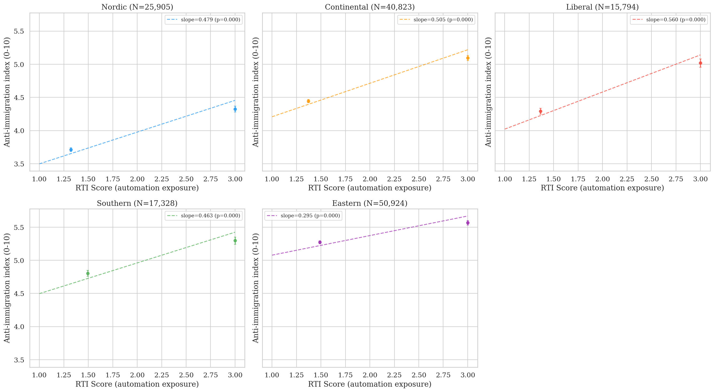
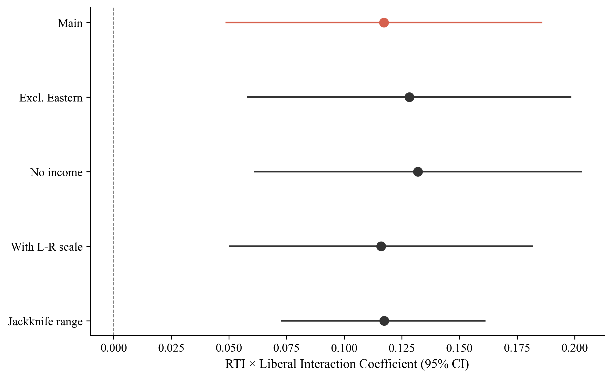
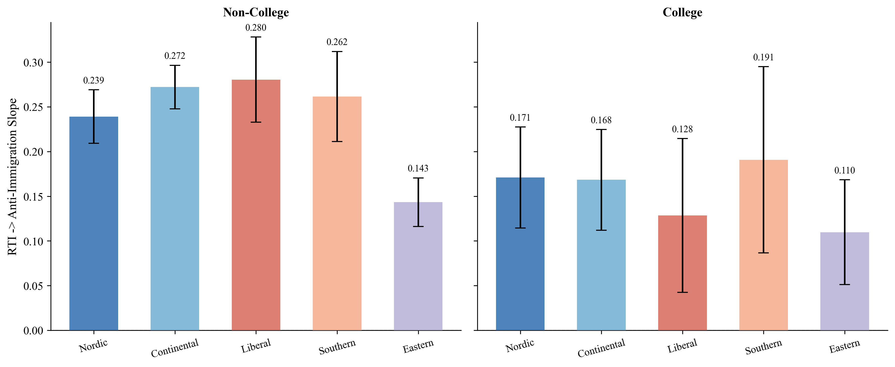

> **Seminar paper — University of Copenhagen, Welfare State Seminar, Spring 2026.**
> The formatted Word version is in this folder: [`Dignity_Is_a_Baseline.docx`](Dignity_Is_a_Baseline.docx). The full text is rendered below.

---

**Dignity Is a Baseline: Welfare Institutions and the Asymmetric
Politics of Economic Disruption**

Ben Smart

University of Copenhagen, Department of Economics

*Welfare State Seminar — Spring 2026*

> *"The goal of social policy, in these times of change and anxiety, is
> to help people absorb the shocks that affect them without allowing
> those shocks to affect their sense of themselves."*
>
> *Banerjee and Duflo (2019)*
>
> **Abstract**
>
> Why does economic disruption so often produce the wrong politics?
> Workers exposed to automation turn against immigrants rather than
> toward the welfare state, and more generous spending has done little
> to stop them; compensation often fails, sometimes backfires, and is
> frequently refused (Gingrich 2019; Stutzmann 2025; Pelc 2025). The
> standard answer, descended from Ruggie's (1982) embedded liberalism,
> treats welfare as a buffer: compensate the losers of economic change,
> and the backlash recedes. The operative variable is quantity. Spend
> more, get less populism. This paper argues the buffering account
> measures the wrong thing. Welfare shapes the direction of the
> political response, not only its intensity, and it does so through
> what it communicates to vulnerable workers about their worth and their
> standing, not through how much it spends; in Banerjee and Duflo's
> (2019) terms, whether it lets them absorb economic shocks without
> those shocks reaching their sense of themselves. The European Social
> Survey (rounds 6–9, 34 countries, N=188,764) shows the gap: automation
> exposure turns into anti-immigration sentiment far more strongly where
> welfare is less decommodifying. Spending effort misses the pattern
> entirely; active labour market expenditure is uncorrelated with the
> cross-national variation (r=0.01, N=15). Decommodification
> (Esping-Andersen 1990) tracks it strongly across these countries
> (r=−0.855, p\<0.001, N=15), and the more defensible individual-level
> interaction holds (β=−0.059, p=0.015, N=81,885). The welfare state's
> signature is clearest on the damage side. Where welfare is more
> decommodifying, vulnerability turns into exclusion less readily; the
> same welfare shows no comparable pull toward solidarity, consistent
> with dignity-preserving welfare clearing the ground for a solidarity
> it does not by itself produce. The paper reads that asymmetry
> cautiously, since the redistributive outcome is measured far more
> coarsely than the exclusionary one. Decommodification, not spending,
> is the dimension along which the politics of economic disruption
> becomes visible.

**I. Introduction**

Workers in routine-task-intensive occupations across Europe support the
populist radical right at strikingly high rates (Gingrich 2019; Kurer
2020; Im et al. 2019; Autor et al. 2020; Gallego and Kurer 2022), and
they do so most where welfare provision is weakest (Vlandas and
Halikiopoulou 2022; Caselli et al. 2021). The pattern is by now well
established. The question this paper takes up is not whether it exists
but why it takes the form it does: why economic disruption turns into
hostility toward immigrants rather than demand for redistribution, and
why people facing genuine vulnerability turn against the welfare state
rather than toward it. This is the wrong politics, the response that
fails the people experiencing the disruption.

The conventional answer treats the welfare state as a buffer. In
Ruggie's (1982) account of embedded liberalism, generous provision
compensates the losers of open markets, and compensation dampens their
resentment; the operative variable is quantity. Spend more, get less
populism. Posing the problem as how much welfare states spend, however,
obscures what they communicate. This paper argues that welfare shapes
the direction of the political response to disruption, not only its
intensity, and that the dimension doing the work is decommodification
rather than spending effort: what the welfare state says to vulnerable
workers about their worth and their citizenship, not how much it
transfers to them.

The evidence is harder on the buffering account than this allows.
Compensation often does not work; in the one careful cross-national
test, automation-exposed workers are no less likely to vote populist
where early retirement, in-kind spending, and labour protection are more
generous (Gingrich 2019). It sometimes backfires. Germany compensated
the communities hit by its coal phase-out, and those communities
abstained and abandoned the party that represented them anyway
(Stutzmann 2025), while austerity predicted Brexit through lost trust
rather than lost income (Fetzer 2019). And it is often refused: workers
prefer reduced hours to compensated unemployment, and employer provision
to the identical transfer from the state (Pelc 2025). Kurer (2020,
p.1801) names the tension directly:

> *"When relative societal decline rather than material hardship are at
> the heart of socially conservative resentment, traditional welfare
> policy may be an insufficient response to satisfy exposed workers and
> hence an ineffective remedy to counter the ascent of right-wing
> populist movements."*

The mechanism runs through what welfare communicates, not what it
spends. Welfare is the one domain where economic vulnerability and
institutional judgement meet at the same moment; when a worker reaches
the welfare state, it allocates resources and renders a verdict on the
worker's claim to them in a single act. Banerjee and Duflo (2019) cast
the task of social policy as helping people absorb economic shocks
without letting those shocks reach their sense of themselves, and this
paper takes the formulation literally. Where welfare preserves that
sense of self, communicating that disruption is a structural problem
calling for a collective answer, workers read their vulnerability
through class and press for redistribution. Where it damages that sense
of self, through means-testing, surveillance, and the message that need
reflects failure, the same vulnerability sets off a cascade of identity
switching (Bonomi, Gennaioli and Tabellini 2021), misattribution
(Gallego and Kurer 2022), and defensive othering (Wagner 2022).
Institutional design communicates worth, citizenship, and belonging, and
those communications carry political weight the generosity literature
has missed.

This is why spending and decommodification come apart. Redistribution
and recognition are not the same good, and they do not substitute:
right-populist voters "care as much, or even more, about recognition as
about redistribution" (Gidron and Hall 2017), and what routine workers
demand is economic and cultural protection at once, the second of which
no transfer can supply (Kurer and Palier 2019). A welfare state can
spend heavily through punitive, conditional channels that register as
generous while communicating suspicion, or it can decommodify, in
Esping-Andersen's (1990) sense letting a person "maintain a livelihood
without reliance on the market", and so communicate standing. Collapse
welfare onto a spending axis, and the two become impossible to tell
apart.

The paper's empirical task is to identify the dimension that does the
work, and to show that it is decommodification, not spending. In the
European Social Survey (rounds 6–9, 34 countries, N=188,764), automation
exposure turns into anti-immigration sentiment far more strongly in
liberal welfare regimes than in Nordic ones (β=0.127, p=0.003). Active
labour market spending, on a matched 15-country sample, tracks none of
this cross-national variation (r=0.01, N=15); decommodification tracks
it strongly (r=−0.855, p\<0.001), though that correlation rests on 15
country-level points, which makes the individual-level interaction the
firmer test; that interaction survives at the individual level and under
macroeconomic controls (β=−0.059, p=0.015, N=81,885). The welfare
state's signature is clearest on the damage side. Where welfare is more
decommodifying, vulnerability turns into exclusion less readily; the
same welfare shows no comparable pull toward solidarity. The paper reads
that asymmetry as dignity-preserving welfare clearing the ground for a
solidarity it does not by itself produce, and reads it cautiously, since
the redistributive outcome is measured far more coarsely than the
exclusionary one and the within-individual test belongs to the
register-based design sketched in §V.G.

The contribution is twofold. The paper connects mechanisms that have
been studied apart, identity switching, misattribution, and defensive
othering, into a single chain, and locates the decommodifying quality of
the welfare state as the condition under which the chain fires. And it
shows that the moderation vanishes under spending measures and sharpens
under decommodification, displacing the buffering model's reliance on
generosity as the variable that matters. Section II makes the case
against buffering; §III sets out the mechanism; §IV bounds its scope; §V
presents the analysis; §VI concludes.

**II. The Limits of the Buffering Model**

The buffering framework introduced in §I treats the welfare state as a
compensatory buffer against political extremism. Its contemporary
applications test whether welfare generosity reduces radical right
support (Vlandas and Halikiopoulou 2022; Halikiopoulou and Vlandas 2016;
Ennser-Jedenastik et al. 2019). The operative variable is quantity.

But the evidence is harder on the framework than this account allows.

**Compensation that does not work.** Gallego and Kurer (2022) flag what
they call a "concerning finding" from Gingrich's (2019) comparative
study, the only careful cross-national analysis testing whether public
policies aimed at alleviating labour market risks for automation-exposed
workers prevent the political turn to protest voting. Gingrich finds
that workers highly exposed to automation are not less likely to vote
for populist parties in countries with more generous early retirement
policies, more in-kind spending, or more protective labour market
regulation. If the buffering model were correct, more generous welfare
states should show weaker automation-to-populism effects. They do not;
as Kurer (2020, p.1826) puts it, "the reverse mechanism (more spending,
less populism) is not borne out by Gingrich's data."

**Compensation that backfires.** Stutzmann (2025) examines Germany's
coal phase-out, a case where affected communities received substantial
compensatory investment and where both compensation and interest group
representation were fulfilled. Material conditions held; affected
municipalities nonetheless showed higher abstention rates and lower
support for the issue-owning party. Bergman (2022) theorises
"self-undermining" policy feedback effects, whereby welfare
interventions visibly benefiting groups that potential radical right
voters view unfavourably can catalyse greater support for the radical
right. Fetzer's (2019) analysis of Brexit makes the channel explicit:
welfare cuts predicted Leave support through the erosion of political
trust and efficacy, rather than through material deprivation. The
institutional channel is doing the political work.

**Compensation that is resisted.** Pelc (2025) shows that a sizeable
portion of workers resist being compensated out of work even when the
compensation fully replaces their income, preferring reduced hours over
unemployment at the same pay, and compensation from employers over
identical compensation from government. The form, source, and meaning of
compensation carry political weight independently of its material
content. As Guriev and Papaioannou (2022) observe, compensating the
losers of economic transformation has proven much harder than economists
assumed, not because of insufficient resources, but because of political
and institutional constraints the buffering framework does not theorise.
Kuziemko et al. (2023) make the complementary point on the demand side.
Less-educated voters in the United States prefer predistribution (wage
protection, work supports) over redistribution as such, suggesting the
resistance Pelc documents is characteristic rather than anomalous.

Burgoon and Schakel (2022) provide the most careful recent empirical
case for the buffering account, and the apparent contradiction with this
paper's null on welfare spending is worth resolving directly. They find
welfare generosity associated with reduced anti-globalization
nationalism in European party platforms. Their result is real and their
measurement careful. The contradiction dissolves once the units of
analysis are kept distinct: Burgoon and Schakel measure platform
language at the party level, while the analysis here measures
attitudinal slopes at the individual level conditional on automation
exposure. The mechanisms that translate aggregate welfare effort into
party platforms (elite incentives, coalition arithmetic, electoral
targeting) differ from the mechanisms that translate institutional
encounter into individual self-concept and exclusionary attitudes. Both
findings can be true. Welfare generosity at scale may dampen the
*supply* of anti-globalization rhetoric in party systems while the
*demand* for exclusionary attitudes among vulnerable workers responds to
a different welfare dimension entirely. The contribution of this paper
is to identify that dimension as decommodification rather than spending
effort, and to locate it at the individual rather than party level.

The buffering model is not entirely wrong. Albanese, Barone and de
Blasio (2022) find that EU structural fund disbursements reduce populist
voting in recipient regions, suggesting visible, tangible local
investment can work where individualised transfers cannot. The finding
cuts the same way as the asymmetric argument developed below. What the
spending says about recipients, and about their relationship to the
political community, is what does the work. Spending effort alone is too
coarse.

**III. The Mechanism: Welfare and the Self-Concept**

***A. What the Evidence Demands***

The central empirical pattern of §V is asymmetric. The theoretical
argument that follows in this section is the falsifiable form of the
central hypothesis stated in §I; §V.D tests its
decommodification-versus-spending half, and §V.F tests the asymmetry on
the solidarity side. The data test the moderating dimension, not the
mechanism: decommodification rather than spending conditions how
disruption converts into exclusion. The cascade developed below is
theorised, not tested; its links are supported citation by citation, and
the within-individual design of the thesis is built to test them.
Welfare institutional context moderates the conversion of automation
exposure into anti-immigration sentiment: the slope is significantly
steeper in Liberal regimes than in Nordic ones, and the moderation
tracks decommodification rather than spending. It does *not* detectably
moderate the conversion of the same exposure into redistributive
solidarity. RTI predicts slightly higher redistribution support across
all regimes, but the cross-regime interaction is small and
non-significant, and a supplementary ISSP analysis (Appendix C) returns
the same null on a different sample and outcome variable. The damage
mechanism is legible. The protective one is not.

However, the natural response is to treat the solidarity null as a
measurement problem. The supplementary analysis suggests the null
survives a few obvious alternatives, and it is also robust to the more
defensible interpretation: the pattern itself appears asymmetric.
Welfare institutions can fail politically in a specific, cumulative way;
the protective converse, actively manufacturing solidarity, is weaker
and harder to detect, for reasons partly substantive and partly of
measurement.

Indeed, the recognition literature has been working toward this claim
for some time. Gidron and Hall (2017, p.26) find that right-populist
voters "care as much, or even more, about recognition as about
redistribution," and that compensation "is not what these people are
looking for." Kurer and Palier (2019) make the complementary point in
the routine-worker context: what routine workers demand is "economic
*and* cultural protection," and the second of those cannot be supplied
through transfer payments. Redistribution and recognition are not
fungible. The asymmetric mechanism takes that non-fungibility as its
starting point.

***B. Why Welfare, and Not Something Else***

The obvious objection is that many institutions shape identity. Media
environments construct group boundaries; religious traditions supply
moral narratives; class structures generate interest coalitions. Why
isolate welfare?

The answer is that welfare is the single state domain where economic
vulnerability and institutional treatment meet. When a worker encounters
the welfare state, the institution allocates resources *and* renders a
judgement about that worker's claim to them, in the same act. Other
identity-shaping institutions cannot match the combination. Courts
render judgement but rarely allocate resources to the individual judged;
markets allocate without judgement, or pretend to; religious
institutions render judgement but cannot compel. Only welfare does both,
and at the point of a person's maximum material dependence.

Wagner's (2022) finding that recipients learn and mirror the recognition
norms the state enacts on them is intelligible only under these
conditions. Because the encounter is materially consequential *and*
judgement-laden, recipients cannot dismiss the signal as one view among
many; they have to metabolise it. Soss (1999) documents the specific
learning. Programmes with respectful implementation foster civic
engagement; programmes characterised by surveillance and conditionality
generate alienation, and the alienation persists. De Blok and Kumlin
(2022) extend the point: procedural fairness preserves institutional
trust most strongly for those whose outcomes are unfavourable, which
means implementation quality matters most precisely for those who are
most economically vulnerable. What the welfare state says about you,
when you encounter it, is part of what you know about yourself.

Furthermore, the mechanism scales beyond direct recipients through three
channels. Workers anticipating future dependency factor present welfare
treatment into present self-understanding. Public discourse mirrors
recipient-level recognition norms (Wagner 2022). And
routine-task-intensive workers are over-represented in welfare caseloads
over the life-course, even though most are employed at any given moment;
the bridge therefore runs as much through anticipated dependency and
public discourse as through current receipt, which is why the
cross-national pattern is detectable in ESS data. A structurally
distinct fourth channel runs through Mettler's (2011) "submerged state":
tax expenditures and indirect benefits serving middle and upper-income
groups that remain invisible as government assistance. Recipients of
submerged welfare attribute their security to personal merit; recipients
of visible welfare are marked as dependents. The two groups look at the
same welfare state but see different institutions, producing a political
identity fracture in which a large share of the population benefits from
the welfare state without recognising it.

***C. The Damage Cascade***

When welfare institutions damage the self-concept, three responses
follow, each harder to reverse than the one before.

The first is identity. Bonomi, Gennaioli, and Tabellini (2021) model how
individuals move from class to cultural identity when class identity is
degraded by economic disruption, and under cultural identity
redistribution demand decreases while cultural conservatism intensifies.
The welfare state enters at a specific point: stigmatising
implementation degrades class identity directly. A worker entering a
system that treats retraining as a citizenship right retains class
identity; a worker entering a system of means-testing and surveillance
has it doubly damaged, by the disruption and by the system's response to
him. Ballard-Rosa, Jensen, and Scheve (2022) provide the downstream
evidence: economic decline activates social identity processes producing
authoritarian values through group status threat. Welfare institutional
mediation, this paper argues, is the missing upstream variable. Im et
al. (2023) confirm in Finnish panel data that *expected* status decline,
not material hardship as such, drives the radical right shift among
routine workers, and expectations are themselves shaped by what workers
observe of how the state treats people in their position.

Once cultural identity is in charge, grievances misattribute. Economic
frustration gets pointed at cognitively available scapegoats. Wu (2022)
confirms the misdirection empirically: workers at higher automation risk
oppose immigration but show no different technology preferences. There
is no analogue on the protective side; no condition under which
structural attribution emerges as a substitute for the cultural
attribution workers would otherwise have made. Alesina and Angeletos
(2005) provide the institutional anchor: conditional welfare systems
produce individual rather than structural attributions.

The third move is defensive othering. Patrick (2016) documents what this
looks like at the recipient level: UK benefit claimants shoring up their
own deservingness through critique of those below them, using the same
criteria the welfare system applied to them. Wagner (2022) calls it
"kicking down" and documents its institutional origins. Im and
Komp-Leukkunen (2021) connect it to automation: routine workers support
strict conditionality because it maintains status distance from groups
below them, not because strict conditionality is in their material
interest.

***D. The Recursive Loop***

The cascade forms a self-sustaining system. Conditional welfare damages
self-concepts. Damaged self-concepts produce othering. Othering
generates public attitudes supporting further conditionality. Political
entrepreneurs respond with welfare chauvinism. Further conditionality
deepens the damage. The loop runs into a population that has forgotten
the position it now defends was constructed for it.

Haugsgjerd and Kumlin (2020) demonstrate the dynamic with panel data:
poor welfare performance reduces political trust, and reduced trust
makes future evaluations more negative; a "downbound spiral." Van
Hootegem, Abts, and Meuleman (2021) name the attitudinal contradiction
the loop produces: the most vulnerable simultaneously support
redistribution in principle and distrust the welfare state in practice.
This gap is the political space the radical right occupies, and it is
constructed by the loop rather than discovered by it.

The loop makes the damage self-concealing. Because the welfare state
produces the attitudes that legitimate its own retrenchment, each
iteration appears more natural than the last. Preferences that are
outputs of policy appear as inputs. This is policy feedback running
backwards; not Pierson's (1994) positive feedback constructing
supportive constituencies, but the reverse, with constituencies
generated against the mechanisms that would serve their material
interests. The cascade ends in the configuration Busemeyer, Rathgeb, and
Sahm (2022) name precisely: the "particularistic-authoritarian" welfare
preference (pro-workfare, anti-poor, anti-social-investment), the
programme of the radical right, generated in part by the welfare
institutions it claims to oppose. On the evidence, its supporters
"strongly support policies that promote new social divisions and the
further exclusion of the unemployed and the poor" (Busemeyer, Rathgeb,
and Sahm 2022, p.96).

***E. Why the Protective Pathway Is Weaker***

The symmetric account would predict that welfare institutions which
preserve the self-concept produce solidarity through a mirror-image
cascade: stable identity, structural attribution, inclusive
deservingness. The paper's empirical null on the solidarity side says
otherwise, and on the reading developed here the null is what the
mechanism actually predicts.

Indeed, three different things are wrong with the symmetric picture.
Loss aversion comes first. Kahneman and Tversky's (1979) finding, that
losses loom larger than equivalent gains in evaluation, applies directly
to dignity shocks. A stigmatising welfare encounter registers as a
status loss; a dignity-preserving encounter does not register as a
status *gain* of equivalent magnitude. What it produces is the absence
of damage, which has a different psychological signature and a different
political one. Damage mobilises; the absence of damage tends not to.
Kurer and van Staalduinen (2022) document the closely related asymmetry
in intergenerational status discordance: voters whose expectations are
unmet show large political shifts, while voters whose expectations are
exceeded show much weaker ones.

Second, status is positional. There is no quantity of status one person
can have without another person having less. Gidron and Hall (2017) make
the point exactly: what right-populist voters want is recognition in the
relational sense, not redistribution in the material sense, and
relational goods cannot be redistributed without losses to the
currently-recognised. Dignity-preserving welfare removes an obstacle to
inclusive solidarity; it does not, by itself, construct the inclusion.
The distinction is between care and connection: welfare design as
currently constituted delivers material care across the Esping-Andersen
regimes, but solidarity is a connection-thick political achievement; it
requires the shared workplaces, organising work, and relational
practices that decommodification can clear the ground for but cannot
construct (Iversen and Soskice 2001; Rothstein 2001; Larsen 2008).
Welfare provides permission, not propulsion.

Third, defensive othering, once committed to, is costly to reverse. A
worker who has built their own deservingness on critique of those below
them has made an identity investment, and identity investments are not
undone by changing the institutional environment alone; they require the
un-doing of identity work that has already happened. This is the
structural reason the recursive loop developed in §III.D, once
initiated, is so difficult to interrupt by institutional reform alone.
The asymmetry runs through the individual as well as the system: dignity
damaged is harder to restore than dignity preserved is to maintain.

Three asymmetries, each with a far weaker mirror image. Dignity is a
baseline good. Its absence damages. Its presence clears the ground for a
solidarity that has to be built on top, by other means.

***F. What the Theory Predicts***

A theory of this shape has to be testable. The asymmetry generates five
predictions sharp enough to fail.

(P1) Cross-national variation in *exclusion* should track dimensions of
welfare design that bear on dignity (decommodification, conditionality,
the punitive-enabling balance of ALMP; see Meuleman et al. 2025) but not
welfare spending effort, because spending is orthogonal to dignity.
Tested in §V.D.

(P2) Cross-national variation in *solidarity* should not track the same
welfare design variables with anything like the same strength, because
solidarity requires supply-side construction (political
entrepreneurship, coalitional framing, electoral system affordances)
that welfare quality alone cannot provide. Tested in §V.F.

(P3) What makes Nordic welfare states distinctive should be the
*absence* of steep exclusion slopes, not the *presence* of
redistributive uplift. The data behaves accordingly: among the Western
European welfare-state genealogies in scope, Nordic RTI→exclusion slopes
are the flattest (§V.C; the negative Eastern interaction is treated as a
scope condition in §IV).

Two further predictions live within rather than across countries and
motivate the registry-based follow-up.

(P4) Welfare reform introducing conditionality should show damage
effects, while welfare reform expanding generosity should show weaker or
null protective effects.

(P5) Panel data should detect path-dependence in individual attitudes,
with workers who experience a stigmatising encounter showing elevated
exclusionary attitudes years later.

Three of the five predictions are tested in this paper; two are written
so that, in the thesis, they can be falsified.

**IV. Scope Conditions and Limits**

The asymmetric mechanism claims something narrower than its symmetric
cousin: welfare institutions are the institutional condition under which
the damage cascade fires, while the protective converse, a symmetric
condition producing a mirror-image solidarity cascade, is weaker and
harder to detect. Three limits bound the claim.

The absence of damage is necessary but not sufficient for solidarity.
Universal programmes build social trust (Rothstein 2001) and produce
inclusive deservingness narratives (Larsen 2008); extensive universal
provision conveys recognition beyond material security (Kurer et al.
2019); Nordic welfare states show consistently lower populist support
despite globalisation pressures (Norris and Inglehart 2019). All real.
On the asymmetric reading, what these findings record is the *baseline*
dignity-preserving welfare provides, not the active *uplift* the
buffering model assumes. The political work that converts baseline
dignity into active solidarity (Bornschier et al. 2024; Jeffrey 2020) is
out of scope here. Welfare design's role in that construction is
permissive, not productive.

Welfare institutions also do not operate on a blank moral slate. Pelc's
(2025) finding that Protestant work ethic predicts compensation
resistance independently of material incentives suggests some attitudes
exist prior to institutional contact. The welfare state shapes moral
frameworks, but it also inherits them.

The loss aversion claim in §III.E borrows from behavioural economics by
analogy. Supporting empirical work (Kurer and van Staalduinen 2022;
Kurer et al. 2019) is consistent with the claim but does not test it
directly. The within-individual test belongs to the registry-based
follow-up. The cross-sectional finding here is large, robust, and
predicted by the theory; it remains provisional in a way the asymmetric
framing itself acknowledges.

A scope condition worth naming concerns Eastern Europe. Table 2 shows
RTI × Eastern is negative and significant (β=−0.132, p\<0.001); the
conversion of automation exposure into anti-immigration sentiment is
*flatter* in low-decommodification Eastern European regimes than in
Nordic ones, the opposite of what a CWED-based theory predicts at face
value. On the institutional-encounter reading developed above, this is
consistent rather than disconfirming: the asymmetric-encounter mechanism
presupposes the welfare-citizenship norms inherited from the
Esping-Andersen genealogy, which post-communist regimes have not had
time to develop in the same form (Vachudova 2020; Bustikova 2019). CEE
welfare states carry different fiscal commitments to
dignity-as-baseline, different inheritance from socialist-era
universalism, and different supply-side radical-right structures. The
15-country CWED-matched sample is therefore not just a data constraint
but a scope condition: the asymmetric mechanism is bounded to Western
European welfare-state genealogies, and the negative Eastern interaction
is consistent with that boundary rather than evidence against the
mechanism inside it.

**V. Empirical Analysis**

***A. Data and Measurement***

The cross-national test that follows identifies the environment channel
delimited in §IV. The analysis uses the European Social Survey (ESS),
rounds 6–9 (fieldwork 2012–2018), covering 34 countries and 188,764
observations.

**Automation exposure** is measured by routine task intensity (RTI)
scores mapped to three-digit ISCO-08 occupation codes following Autor,
Levy, and Murnane (2003) and Goos, Manning, and Salomons (2014). Match
rate: 87.8% (N=165,667).

**Exclusionary attitudes** are measured by a three-item anti-immigration
index (whether immigrants make the country worse, undermine cultural
life, or are bad for the economy; reverse-coded 0–10; Cronbach's
α=0.864).

**Welfare institutional context** is operationalised in three ways.
Countries are classified into welfare regimes following Esping-Andersen
(1990) and Ferrera (1996): Nordic (DK, SE, NO, FI, IS), Continental (DE,
FR, AT, BE, NL, CH), Liberal (GB, IE), Southern (ES, IT, PT, CY), and
Eastern (CZ, PL, HU, SK, SI, EE, LT, LV, BG, HR). Country-level ALMP
spending (% of GDP) is drawn from the CPDS (22 countries). Total welfare
generosity from the Comparative Welfare Entitlements Dataset (CWED),
measured as the mean decommodification score across unemployment,
sickness, and pension programmes for 2005–2011 (15 Western European
countries).

**Controls** include age, age squared, gender, education (ES-ISCED),
household income decile, and urban/rural residence.

***B. Empirical Strategy***

The core test is a cross-level interaction:

*Y*\_ij = β₀ + β₁(RTI_i) + β₂(Welfare_j) + β₃(RTI_i × Welfare_j) +
γ(**X**\_i) + u_j + ε_ij

where β₃ tests whether the conversion of automation exposure into
exclusionary attitudes depends on welfare institutional context. The
analysis estimates mixed models with country-wave random slopes for RTI
(1 + RTI \| country-wave), confirmed over random intercepts alone by
likelihood ratio test. Models 1–5 use this random-slopes specification;
the radical-right-vote model (Model 6) and the Appendix A robustness
battery retain the earlier random-intercept estimator. OLS with
country-wave fixed effects and clustered standard errors serves as a
robustness check; results are directionally identical. The
cross-sectional design cannot establish causality. The test is whether
the pattern is consistent with the asymmetric mechanism developed in
§III and inconsistent with the symmetric "more spending = less backlash"
alternative.

***C. Descriptive Results***

Figure 1 presents the central descriptive finding. Across all welfare
regimes, higher RTI is associated with more anti-immigration attitudes;
the relationship is positive and significant everywhere. The slope is
steepest in Liberal regimes (β=0.512), followed by Southern (β=0.462),
Continental (β=0.443), Nordic (β=0.413), and Eastern (β=0.263). These
are descriptive slopes; the regime interactions in Table 2 are expressed
relative to the Nordic baseline, so Eastern, positive here but the
flattest, enters Table 2 with a negative sign. The marginal effects plot
(Figure 2) makes the comparison precise: a one-standard-deviation
increase in RTI is associated with approximately 0.32 additional scale
points of anti-immigration sentiment in Liberal regimes, compared to
0.20 in Nordic regimes. The gap is statistically significant and
substantively meaningful.

**Figure 1.** *RTI vs. anti-immigration by welfare regime. Five-panel
binned scatter.*

**Figure 2.** *Marginal effect of 1-SD RTI increase by welfare regime.*

***D. The CWED Finding: Decommodification as the Operative Variable***

Comparing two welfare measures produces the paper's most important
finding.

When individual countries' RTI→anti-immigration slopes are plotted
against their ALMP spending levels (restricting to the same 15 Western
European countries used in the CWED analysis), the correlation is
near-zero (r=0.01, p=0.97, N=15). Countries spending more on active
labour market policies show no systematically flatter or steeper
vulnerability-to-exclusion slopes. Spending effort, holding sample
constant, is unrelated to the exclusion pattern.

The picture changes dramatically when welfare is measured by its
decommodifying quality. Figure 3 plots the same country-level slopes
against CWED total generosity, the composite score capturing how
effectively welfare systems enable workers to sustain living standards
without employment. The correlation is strongly negative: r=−0.855,
p\<0.001, N=15 countries. Welfare generosity measured as
decommodification is associated with 73 per cent of the cross-country
variation in how strongly automation exposure co-varies with
exclusionary attitudes. The United Kingdom, lowest in CWED generosity,
shows the steepest slope. Norway, highest in generosity, shows the
flattest.

These country-level slopes are extracted as best linear unbiased
predictors (BLUPs) from a random-slopes mixed model with
individual-level controls (age, age², gender, education, income, urban
residence); this specification partials out within-country covariation
between RTI and demographics that would otherwise contaminate a
bivariate slope estimate, while letting each country's slope estimate
borrow strength from the cross-country variance structure. The simpler
bivariate per-country OLS alternative (no controls, no information
sharing across countries) gives a directionally identical but weaker
correlation with CWED (r=−0.625, p=0.013, N=15) and is reported in the
replication appendix.

**Figure 3.** *CWED generosity vs. country-level RTI→anti-immigration
slopes.*

At the individual level, Model 3 confirms this with the cross-level
interaction (Table 1):

**Table 1.** Cross-level interaction of RTI and CWED generosity (Model
3; random slopes; N=81,885).

| **Variable**              | **β**      | **SE**    | **p**     |
|---------------------------|------------|-----------|-----------|
| RTI                       | 0.215      | 0.025     | \<0.001   |
| CWED generosity           | -0.069     | 0.064     | 0.281     |
| **RTI × CWED generosity** | **-0.059** | **0.024** | **0.015** |

The interaction is negative and significant (β=−0.059, p=0.015,
N=81,885): a one-standard-deviation increase in welfare generosity
reduces the marginal effect of RTI on anti-immigration attitudes by
0.059 scale points. The larger standard error relative to earlier
specifications reflects the conservative random-slopes estimator, which
absorbs cross-national slope heterogeneity. The finding is robust to
country-level GDP growth and Gini controls (β=−0.066, p\<0.001), arguing
against the concern that decommodification proxies for broader economic
conditions.

The ALMP/CWED contrast is the paper's central empirical argument, and it
maps directly onto the theoretical distinction in §III. Bonoli's (2013)
typology and the more recent treatment in Meuleman et al. (2025) explain
why: ALMP aggregates across enabling programmes (upskilling, employment
counselling) and punitive ones (benefit sanctions, behavioural
conditionality), so the political signature of the punitive subset
cancels out against the enabling subset. CWED measures what the welfare
state *provides* rather than what it *demands*, which is the asymmetric
mechanism's exact prediction.

Denmark presents an instructive complication. Despite high CWED
generosity, Denmark shows a relatively steep RTI→exclusion slope
(β=0.24, a control-adjusted BLUP, on a different and lower scale than
the descriptive regime slopes of §V.C), higher than Finland, Sweden, or
Norway. Danish "flexicurity" combines generous benefits with high labour
market flexibility and active job search requirements, creating a system
generous in transfers but demanding in activation. On the asymmetric
reading, this is not an anomaly but an additional piece of evidence:
conditionality and surveillance damage the self-concept even when
transfer levels are high. Decommodification is the best available
cross-national proxy for what welfare provides and communicates, not a
direct measure of the texture of the encounter; Denmark is therefore
read here as suggestive rather than confirmatory. The
activation-introducing reforms of 2003, 2006, and 2013 are exactly the
kind of within-country shock the asymmetric theory predicts should
produce damage signatures with decommodification held constant. The
country-level finding is robust to all single-country exclusions:
excluding the United Kingdom (lowest CWED) gives r=−0.808; excluding
Norway (highest CWED) gives r=−0.793; excluding both simultaneously
gives r=−0.700 (p=0.008). Across the full set of 105 two-country BLUPs
jackknife pairs the correlation ranges from r=−0.700 to r=−0.922, no
pair flips sign, and 105 of 105 retain significance at p\<0.05; the
result does not depend on any single case or any pair of cases jointly.

***E. Main Models***

Table 2 presents the multilevel results. Model 1 confirms that RTI
predicts anti-immigration attitudes after controls (β=0.168, p\<0.001,
N=133,016). Model 2 introduces regime interactions with Nordic as
reference:

**Table 2.** Multilevel models of anti-immigration attitudes (Models
1–2; random slopes; Nordic baseline).

| **Interaction**       | **β**     | **SE**    | **p**     |
|-----------------------|-----------|-----------|-----------|
| RTI (Nordic baseline) | 0.194     | 0.025     | \<0.001   |
| RTI × Continental     | 0.034     | 0.032     | 0.288     |
| RTI × Liberal         | **0.127** | **0.043** | **0.003** |
| RTI × Southern        | 0.029     | 0.039     | 0.454     |
| RTI × Eastern         | -0.132    | 0.031     | \<0.001   |

Automation exposure is associated with anti-immigration sentiment
significantly more strongly in Liberal welfare regimes than in Nordic
ones (β=0.127, p=0.003). A one-standard-deviation increase in RTI is
associated with 0.127 additional scale points of anti-immigration
sentiment in Liberal compared to Nordic contexts, after controlling for
individual characteristics. The larger standard errors compared to
fixed-effects specifications reflect the random-slopes estimator; the
substantive pattern is unchanged.

***F. The Asymmetric Confirmation***

Importantly, the redistribution models confirm the asymmetric prediction
set out in §III, and they do so in the place where the symmetric account
most needed them to fail. RTI predicts slightly more redistribution
support across all regimes (β=0.041, p\<0.001). The cross-regime
variation that drives the exclusion finding does not appear on the
solidarity side: the RTI × Liberal coefficient is small and
non-significant (β=0.013, SE=0.019, p=0.488). Welfare institutional
context cleanly attenuates the conversion of vulnerability into
exclusion. It does not detectably moderate the conversion of the same
vulnerability into redistributive solidarity. That is the asymmetry. It
is consistent with what the theory predicted in §III.F (P2), though it
should be read cautiously.

The ISSP 2006 Role of Government module (N=10,216, 12 countries)
provides a second test on a different sample, outcome, and time period.
The result: no interaction between automation exposure and welfare
generosity on unemployment spending support (β=+0.010, SE=0.016,
p=0.55). A second null. The 2006 data predate the automation discourse
of Frey and Osborne (2017) by several years; the protective pathway, on
the reading developed here, requires automation exposure to register as
a salient class-level threat in public discourse before solidarity can
be politically organised around it, while the damage pathway carries no
such contextual requirement. The asymmetry is detectable across temporal
contexts in which the underlying material vulnerabilities are themselves
shifting.

A measurement-problem reading of the redistribution null is available,
but it does not survive a positive test: against smallest-effect
thresholds anchored in comparable interaction magnitudes from the
redistribution-attitudes literature (Margalit 2013; Rehm 2009), a
two-one-sided-tests procedure places the RTI × welfare interaction on
redistribution statistically equivalent to zero (p_TOST \< 0.001 at a
0.10 standardised-effect threshold; p = 0.028 at 0.05). The substantive
reading, consistent with the asymmetric theory, is that welfare design's
political effects are real and mediated by decommodification rather than
spending; whether they run more reliably toward damage than toward
repair is harder to settle, since the two outcomes are measured very
differently.

The two pathways are not measured with equal fidelity. The
anti-immigration outcome is a three-item composite (α=0.864) with broad
dispersion (3.0% of respondents at the ceiling), whereas redistribution
support is a single item with a pronounced ceiling (31.3% at the
maximum). A more compressed, ceiling-bound outcome will tend to yield
weaker estimated moderation regardless of the underlying mechanism. The
asymmetry reported here is therefore partly substantive and partly a
feature of measurement; the contrast between the damage and protective
pathways should be read as provisional, and adjudicating it requires an
outcome measured with comparable fidelity and the within-individual
design discussed in §V.G.

The radical right voting models (Model 6) require honest treatment. RTI
predicts radical right voting in Nordic countries (β=0.220, p\<0.001)
but the RTI × Liberal interaction is *negative* and significant
(β=−0.123, p=0.032), opposite in direction to the attitudinal finding.
This is not a contradiction of the mechanism; it is what happens when
supply-side institutions intervene between attitudes and votes (see
§VI). The behavioural models are descriptive of electoral systems'
translation of attitudes into votes, not tests of the asymmetric
mechanism itself.

***G. Limitations***

Ultimately, several limits matter for how to read these findings. The
cross-sectional design cannot establish temporal ordering, though the
welfare measure does at least precede the outcome: CWED is drawn from
2005–2011, the ESS attitudes from 2012–2018, which lends the ordering
weak empirical support rather than none. Country-level welfare
indicators are confounded with other institutional differences; Nordic
countries with high CWED generosity also tend to have higher social
trust, stronger unions, proportional electoral systems, and lower ethnic
heterogeneity, and the macro-controls robustness check (GDP growth,
Gini) addresses macroeconomic confounders but not these deeper
institutional correlates. The CWED finding, while striking (r=−0.855),
rests on 15 country-level observations. The individual-level Model 3
interaction provides a more defensible test, but full identification
requires within-country variation in welfare generosity over time,
exploiting CWED changes following benefit reforms. A within-country
sanity check using NUTS-2 regional aggregates (Milner 2021) does not
reproduce the country-level pattern: the meta-correlation of regional
RTI→radical-right vote share with CWED is r=+0.15 (p=0.66), and 8 of 12
within-country regional slopes are negative. This divergence is
consistent with a classical ecological-individual mismatch rather than a
refutation of the finding; the thesis follow-up therefore exploits
within-individual register linkage rather than regional aggregates,
since aggregation level matters and country-level slopes are not
redeemed by a regional pattern in the same direction. The Danish
activation reforms of 2003, 2006, 2010, and 2013 (and the
within-individual administrative-register linkage they make tractable)
are the design indicated by these limitations, and will be pursued in
subsequent work.

**VI. Discussion and Conclusion**

The evidence supports the asymmetric account theorised in §III. Welfare
design shapes how economic disruption turns into exclusion. It does not
equivalently shape how the same disruption turns into solidarity.
Disruption processed through welfare institutions that preserve the
self-concept does not, in this data, produce detectably stronger
redistributive demand than disruption processed through institutions
that damage it. Disruption processed through institutions that damage
the self-concept does produce detectably stronger exclusionary
attitudes. The damage mechanism is legible across every specification.
The protective pathway is not detectable here, on a redistribution
measure this coarse.

The ALMP/CWED contrast bears directly on the theoretical argument. The
buffering model asks how much the welfare state spends. The asymmetric
mechanism asks what the welfare state communicates. A country can spend
heavily on active labour market policies that are punitive, conditional,
and dignity-stripping, and the spending will register as "generous" in
conventional measures while communicating suspicion to the people on the
receiving end. Decommodification captures what spending alone cannot:
the degree to which the welfare state enables citizens to maintain their
living standards and their sense of themselves without dependence on
market employment. This is the institutional quality Banerjee and Duflo
(2019) identify as the goal of social policy. It is what Kurer and
Palier (2019) mean by the economic and cultural protection routine
workers demand, and what Gidron and Hall (2017) capture in their account
of recognition mattering to right-populist voters as much as
redistribution. Three vocabularies, one institutional dimension.

The findings change the long-running debate about whether radical right
support has "economic" or "cultural" roots. Ciccolini (2025, p.12)
argues the distinction is "flawed" because "voters give a cultural
reading to economic phenomena, namely those that they experience
firsthand," and the present paper pushes that argument in an
institutional direction. Welfare design is part of what shapes whether
economic disruption receives a cultural reading in the first place.
Cultural backlash is not a rival explanation to the economic one; it is
what economic disruption looks like, cross-nationally, where welfare
institutions are less decommodifying. The cultural reading has no
symmetric counterpart on the protective side.

The argument is about attitudinal sorting, not vote translation. The
behavioural results in §V.F are better read as confirmation of that
distinction than as a puzzle. Attitudes sort; supply-side institutions
then determine whether attitudes become votes. Ireland has no
electorally significant radical right party in this period. The UK's
first-past-the-post system suppresses radical right seat conversion
despite substantial UKIP vote shares; high-RTI Liberal-regime voters
channelled exclusionary preferences into Brexit. A full account of how
sorted attitudes become exclusionary politics is a separate paper.

The "dignity dividend" is a property of how welfare is *experienced*, of
whether the encounter leaves a person feeling like a citizen or a
supplicant. Standard generosity measures cannot capture it. The Danish
2003, 2006, and 2013 activation reforms introduced conditionality of
exactly the kind the asymmetric theory predicts should produce damage
signatures, with underlying decommodification levels held relatively
constant; that is as close to a quasi-experimental setting on the
dignity margin as the available data permits, and it is where the test
the present paper cannot run will have to be run.

Decommodification, not spending, is the dimension of welfare design
along which the political consequences of economic disruption are
visible. The consequences themselves appear asymmetric, clearly toward
damage and far less reliably toward repair, though the solidarity side
is measured more coarsely. The buffering model's instinct, that welfare
design matters politically, is correct. Its specific account of *how*
(symmetric, quantity-based) is wrong in a way the data and the theory
now make legible together. Dignity is a baseline good. The buffering
model has been treating it as a quantity.

**References**

Alesina, A. and Angeletos, G.-M. (2005). 'Fairness and Redistribution.'
*American Economic Review*, 95(4), pp. 960–980.

Albanese, G., Barone, G. and de Blasio, G. (2022). 'Populist Voting and
Losers' Discontent: Does Redistribution Matter?' *European Economic
Review*, 141, 104315.

Autor, D. H., Dorn, D., Hanson, G. and Majlesi, K. (2020). 'Importing
Political Polarization?' *American Economic Review*, 110(10), pp.
3139–3183.

Autor, D. H., Levy, F. and Murnane, R. J. (2003). 'The Skill Content of
Recent Technological Change.' *Quarterly Journal of Economics*, 118(4),
pp. 1279–1333.

Ballard-Rosa, C., Jensen, A. and Scheve, K. (2022). 'Economic Decline,
Social Identity, and Authoritarian Values.' *International Studies
Quarterly*, 66(1), sqab027.

Banerjee, A. and Duflo, E. (2019). *Good Economics for Hard Times.*
PublicAffairs.

Bergman, M. E. (2022). 'Labour Market Policies and Support for Populist
Radical Right Parties: The Role of Nostalgic Producerism, Occupational
Risk, and Feedback Effects.' *European Political Science Review*, 14(4),
pp. 520–543.

Bonoli, G. (2013). *The Origins of Active Social Policy.* Oxford
University Press.

Bonomi, G., Gennaioli, N. and Tabellini, G. (2021). 'Identity, Beliefs,
and Political Conflict.' *Quarterly Journal of Economics*, 136(4), pp.
2371–2411.

Bornschier, S., Haffert, L., Häusermann, S., Steenbergen, M. and
Zollinger, D. (2024). *Cleavage Formation in the 21st Century: How
Social Identities Shape Voting Behavior in Contexts of Electoral
Realignment.* Cambridge University Press.

Burgoon, B. and Schakel, W. (2022). 'Embedded Liberalism or Embedded
Nationalism? How Welfare States Affect Anti-Globalisation Nationalism in
Party Platforms.' *West European Politics*, 45(1), pp. 50–76.

Busemeyer, M. R., Rathgeb, P. and Sahm, A. H. J. (2022). 'Authoritarian
Values and the Welfare State: The Social Policy Preferences of Radical
Right Voters.' *West European Politics*, 45(1), pp. 77–101.

Bustikova, L. (2019). *Extreme Reactions: Radical Right Mobilization in
Eastern Europe.* Cambridge University Press.

Caselli, M., Fracasso, A. and Traverso, S. (2021). 'Globalization,
Robotization and Electoral Outcomes: Evidence from Spatial Regressions
in Italy.' *Journal of Regional Science*, 61(1), pp. 86–111.

Ciccolini, G. (2025). 'Who Is Left Behind? Economic Status Loss and
Populist Radical Right Voting.' *Perspectives on Politics*.

Colantone, I. and Stanig, P. (2018). 'The Trade Origins of Economic
Nationalism.' *American Journal of Political Science*, 62(4), pp.
936–953.

De Blok, L. and Kumlin, S. (2022). 'Losers' Consent in Changing Welfare
States: Output Dissatisfaction, Experienced Voice and Political
Distrust.' *Political Studies*, 70(4), pp. 867–886.

Ennser-Jedenastik, L., Köppl-Turyna, M. and others (2019). 'Cushion or
Catalyst? Welfare State Generosity and Radical Right Voting.' *European
Political Science Review*, 11(4).

Esping-Andersen, G. (1990). *The Three Worlds of Welfare Capitalism.*
Princeton University Press.

Ferrera, M. (1996). 'The "Southern Model" of Welfare.' *Journal of
European Social Policy*, 6(1), pp. 17–37.

Fetzer, T. (2019). 'Did Austerity Cause Brexit?' *American Economic
Review*, 109(11), pp. 3849–3886.

Frey, C. B. and Osborne, M. A. (2017). 'The Future of Employment: How
Susceptible Are Jobs to Computerisation?' *Technological Forecasting and
Social Change*, 114, pp. 254–280.

Gallego, A. and Kurer, T. (2022). 'Automation, Digitalization, and
Artificial Intelligence in the Workplace.' *Annual Review of Political
Science*, 25, pp. 463–484.

Gidron, N. and Hall, P. A. (2017). 'The Politics of Social Status.'
*British Journal of Sociology*, 68(S1), pp. S57–S84.

Gingrich, J. (2019). 'Did State Responses to Automation Matter for
Voters?' *Research and Politics*, 6(1).

Goos, M., Manning, A. and Salomons, A. (2014). 'Explaining Job
Polarization: Routine-Biased Technological Change and Offshoring.'
*American Economic Review*, 104(8), pp. 2509–2526.

Guriev, S. and Papaioannou, E. (2022). 'The Political Economy of
Populism.' *Journal of Economic Literature*, 60(3), pp. 753–832.

Halikiopoulou, D. and Vlandas, T. (2016). 'Risks, Costs and Labour
Markets: Explaining Cross-National Patterns of Far Right Party Success
in European Parliament Elections.' *Journal of Common Market Studies*,
54(3), pp. 636–655.

Haugsgjerd, A. and Kumlin, S. (2020). 'Downbound Spiral?' *West European
Politics*, 43(4), pp. 969–990.

Im, Z. J., Wass, H., Kantola, A. and Kauppinen, T. M. (2023). 'With
Status Decline in Sight, Voters Turn Radical Right: How Do Experience
and Expectation of Status Decline Shape Electoral Behaviour?' *European
Political Science Review*, 15(1), pp. 116–135.

Im, Z. J. and Komp-Leukkunen, K. (2021). 'Automation and Public Support
for Workfare.' *Journal of European Social Policy*, 31(4), pp. 457–472.

Im, Z. J., Mayer, N., Palier, B. and Rovny, J. (2019). 'The "Losers of
Automation".' *Research and Politics*, 6(1).

Iversen, T. and Soskice, D. (2001). 'An Asset Theory of Social Policy
Preferences.' *American Political Science Review*, 95(4), pp. 875–893.

Jeffrey, K. (2020). 'Automation and the Future of Work: How Rhetoric
Shapes the Response in Policy Preferences.' Working Paper.

Kahneman, D. and Tversky, A. (1979). 'Prospect Theory: An Analysis of
Decision under Risk.' *Econometrica*, 47(2), pp. 263–291.

Kurer, T. (2020). 'The Declining Middle.' *Comparative Political
Studies*, 53(10–11), pp. 1798–1835.

Kurer, T., Häusermann, S., Wüest, B. and Enggist, M. (2019). 'Economic
Grievances and Political Protest.' *European Journal of Political
Research*.

Kurer, T. and Palier, B. (2019). 'Shrinking and Shouting: The Political
Revolt of the Declining Middle in Times of Employment Polarization.'
*Research and Politics*, 6(1).

Kurer, T. and van Staalduinen, B. (2022). 'Disappointed Expectations:
Downward Mobility and Electoral Change.' *American Political Science
Review*, 116(4), pp. 1340–1356.

Kuziemko, I., Longuet-Marx, N. and Naidu, S. (2023). 'Compensate the
Losers? Economic Policy and the Origins of U.S. Partisan Realignment.'
NBER Working Paper 31794 (forthcoming, *Quarterly Journal of
Economics*).

Larsen, C. A. (2008). 'The Institutional Logic of Welfare Attitudes.'
*Comparative Political Studies*, 41(2), pp. 145–168.

Margalit, Y. (2013). 'Explaining Social Policy Preferences: Evidence
from the Great Recession.' *American Political Science Review*, 107(1),
pp. 80–103.

Mettler, S. (2011). *The Submerged State.* University of Chicago Press.

Meuleman, B., Van Hootegem, A., Rossetti, F. and Abts, K. (2025). 'Two
Faces of Activation Attitudes: Explaining Citizens' Diverging Views on
Demanding versus Enabling Activation Policies.' *Social Policy &
Administration*, 59(1), pp. 174–191.

Milner, H. V. (2021). 'Voting for Populism in Europe.' *Comparative
Political Studies*, 54(13).

Norris, P. and Inglehart, R. (2019). *Cultural Backlash.* Cambridge
University Press.

Patrick, R. (2016). 'Living with and Responding to the "Scrounger"
Narrative.' *Journal of Poverty and Social Justice*, 24(3), pp. 245–259.

Pelc, K. (2025). 'On Paying Workers to Stop Working: Public Attitudes
toward "Wage Buyouts".' *Perspectives on Politics*.

Pierson, P. (1994). *Dismantling the Welfare State?* Cambridge
University Press.

Rehm, P. (2009). 'Risks and Redistribution: An Individual-Level
Analysis.' *Comparative Political Studies*, 42(7), pp. 855–881.

Rothstein, B. (2001). 'The Universal Welfare State as a Social Dilemma.'
*Rationality and Society*, 13(2), pp. 213–233.

Ruggie, J. G. (1982). 'International Regimes, Transactions, and Change.'
*International Organization*, 36(2), pp. 379–415.

Soss, J. (1999). 'Lessons of Welfare.' *American Political Science
Review*, 93(2), pp. 363–380.

Stutzmann, S. (2025). 'Asymmetric Backlash against Structural Economic
Change: The Electoral Consequences of the Coal Phase-Out in Germany.'
*European Journal of Political Research*.

Vachudova, M. A. (2020). 'Ethnopopulism and Democratic Backsliding in
Central Europe.' *East European Politics*, 36(3), pp. 318–340.

Van Hootegem, A., Abts, K. and Meuleman, B. (2021). 'The Welfare State
Criticism of the Losers of Modernization: How Social Experiences of
Resentment Shape Populist Welfare Critique.' *Acta Sociologica*, 64(2),
pp. 125–143.

Vlandas, T. and Halikiopoulou, D. (2022). 'Welfare State Policies and
Far Right Party Support: Moderating "Insecurity Effects" Among Different
Social Groups.' *West European Politics*, 45(1), pp. 24–49.

Wagner, P. (2022). 'Kicking Down on the Ladder of Deservingness:
Attitudinal Reactions to Experiences with Welfare Conditionality.'
Working Paper. doi:10.31235/osf.io/arvh5

Wu, N. (2022). 'Misattributed Blame?' *Political Science Research and
Methods*, 10(3), pp. 470–487.

**Appendix A: Robustness Checks**

Figure A1 presents a coefficient stability plot for the RTI × Liberal
interaction across specifications. The coefficient ranges from 0.073
(jackknife excluding GB) to 0.161 (jackknife excluding IE), with a
jackknife mean of 0.117 and standard deviation of 0.013. The result
survives exclusion of Eastern European countries (β=0.128), removal of
the income control (β=0.132), and inclusion of left-right self-placement
(β=0.116). The 95% confidence interval never includes zero in any
specification.

The CWED×RTI interaction is similarly robust. Adding country-level GDP
growth and post-fiscal Gini as macro controls (sourced from the
Comparative Political Data Set over 2012–2018) leaves the buffering
coefficient essentially unchanged (β=−0.066, p\<0.001), arguing against
the concern that decommodification proxies for broader economic
conditions rather than welfare quality per se.

**Figure A1.** *Coefficient stability across robustness specifications.*

**Appendix B: Education Moderation**

The descriptive analysis reveals that the RTI→anti-immigration
relationship is steeper for non-college workers in all regimes. In
Liberal regimes, the bivariate slope drops from 0.280 (non-college) to
0.128 (college), a 54 per cent reduction. This pattern is consistent
with the theoretical prediction that education provides alternative
identity resources buffering the switch from class to cultural identity.

**Figure B1.** *RTI→anti-immigration slopes by education and welfare
regime.*

The formal three-way interaction (Model 4: RTI × regime × non-college)
shows a positive but non-significant coefficient for the RTI × Liberal ×
non-college term (β=0.037, p=0.542). The formal test does not reach
conventional significance thresholds. The descriptive pattern is
consistent with the theoretical prediction, and parallels the finding of
Ballard-Rosa, Jensen, and Scheve (2022) that education buffers the
economic decline → authoritarian values pathway; it should be treated as
exploratory pending a design with adequate statistical power for
three-way interactions.

**Appendix C: The Solidarity Pathway: Supplementary ISSP Test**

Model 5 (redistribution support, *gincdif* reverse-coded 1–5) shows RTI
predicting slightly more redistribution support everywhere (β=0.041,
p\<0.001), but the cross-regime interaction does not match symmetric
predictions: the RTI × Liberal coefficient is small and non-significant
(β=0.013, SE=0.019, p=0.488). The institutional moderation of the
vulnerability→solidarity pathway is not detectable in the ESS data; this
is a result the asymmetric theory of §III predicts and the empirical
analysis of §V.F treats as confirmation rather than limitation.

The supplementary test using the ISSP 2006 Role of Government module
(N=10,216, 12 countries) reported in §V.F provides further detail.
Model: solidarity ~ task_z \* cwed_z + controls + (1 + task_z \|
country). RTI × CWED interaction: β=+0.010, SE=0.016, p=0.55. OLS
cross-check: β=−0.012, p=0.77 (opposite sign). Main RTI effect:
β=−0.109; routine workers in 2006 wanted *less* spending, before the
automation discourse of Frey and Osborne (2017) reshaped how these
workers' material position was being culturally framed. The temporal
scope condition matters for the asymmetric theory: it suggests the
protective pathway requires automation exposure to register as a salient
class threat, not merely as individual occupational risk, while the
damage pathway is detectable without similar contextual scaffolding
because conditional welfare encounters carry their own salience.

The redistribution asymmetry (clear exclusion effects against no
detectable solidarity effects) is consistent across the ESS Model 5 null
and the ISSP Model 5 null. Distinguishing residual measurement
limitations from the substantive theoretical asymmetry developed in §III
requires panel data tracking individuals across periods of welfare
reform; a design to be pursued in subsequent work.
